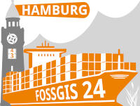

# FOSSGIS 2024 Workshop PostgreSQL/PostGIS für Einsteiger auf der FOSSGIS 2024 in Hamburg

Konferenz-Website https://www.fossgis-konferenz.de/2024/

[FOSSGIS 2023 Workshop-Ankündigung](https://pretalx.com/fossgis2024/talk/38RFDU/)

 

-> hier geht es zum Workshop 
https://github.com/astroidex/fossgis-2024-workshop-postgresql-postgis-fuer-einsteiger/blob/main/fossgis-2024-workshop-postgresql-postgis-fuer-einsteiger.md

## Jörg Thomsen

* Jörg Thomsen
* WhereGroup GmbH
* joerg.thomsen@wheregroup.com

## Annika Schmidt

* WhereGroup GmbH
* annika.schmidt@wheregroup.com

## Workshopmaterial Astrid Emde

* Astrid Emde
* WhereGroup GmbH
* astrid.emde@wheregroup.com
* [@astroidex](https://twitter.com/astroidex)

## weitere Workshops

* siehe auch PostgreSQL/PostGIS für Fortgeschrittene https://github.com/astroidex/fossgis-2018-workshop-postgresql-postgis-fuer-fortgeschrittene-aemde/blob/master/README.md 

